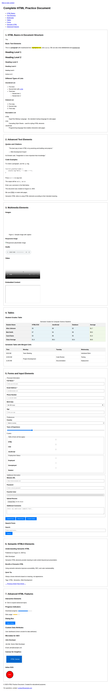

# HTML Basics - Comprehensive Learning Resource

## What is this?

This repository contains a **comprehensive HTML practice document** that serves as an educational resource for learning HTML from basic to advanced concepts. It's a single, self-contained HTML file (`index.html`) that demonstrates all major HTML features and best practices.



*Screenshot showing the rendered HTML document with all sections visible*

## 📋 Contents Overview

The `index.html` file is organized into 7 main sections:

### 1. HTML Basics & Document Structure
- Basic text elements (paragraphs, emphasis, strong, small, etc.)
- Heading hierarchy (h1-h6)
- Different types of lists (unordered, ordered, description lists)
- Nested list structures

### 2. Advanced Text Elements  
- Blockquotes and inline quotes with citations
- Code examples and preformatted text
- Keyboard shortcuts and computer output
- Time and date elements
- Abbreviations and definitions

### 3. Multimedia Elements
- Images with different attributes and responsive design
- Audio and video elements with multiple sources
- Embedded content (iframes)
- Figure and figcaption elements

### 4. Tables
- Complex tables with headers, footers, and captions
- Tables with merged cells (colspan, rowspan)
- Proper semantic table structure
- Column grouping and styling

### 5. Forms and Input Elements
- Comprehensive form with all input types
- Form validation and accessibility
- Fieldsets and legends for grouping
- Range sliders, color pickers, file uploads
- Form controls with proper labeling

### 6. Semantic HTML5 Elements
- Article, section, aside, nav structures
- Proper header and footer usage
- Address and time elements
- Semantic document organization

### 7. Advanced HTML Features
- Interactive details/summary elements
- Progress bars and meter elements
- Dialog boxes (modal functionality)
- Canvas for graphics programming
- Inline SVG graphics
- Custom data attributes
- Microdata for SEO

## 🎯 Purpose

This resource is designed for:

- **Students** learning HTML and web development
- **Educators** teaching web development courses
- **Developers** referencing HTML best practices
- **Testing** HTML rendering across different browsers
- **Demonstration** of modern HTML5 capabilities

## ✨ Key Features

- **Self-contained**: No external dependencies
- **Educational**: Comprehensive comments and examples
- **Accessible**: Proper ARIA labels and semantic structure
- **Interactive**: Working forms, canvas, and JavaScript
- **Modern**: Uses latest HTML5 features and best practices
- **SEO-optimized**: Proper meta tags and microdata

## 🚀 How to Use

1. **View in Browser**: Open `index.html` in any modern web browser
2. **Local Development**: Use a local server for best results:
   ```bash
   # Using Python
   python3 -m http.server 8000
   
   # Using Node.js
   npx serve .
   
   # Then open http://localhost:8000
   ```
3. **Study the Code**: Examine the HTML source to understand structure and techniques
4. **Experiment**: Modify the code to practice HTML concepts

## 📖 Learning Path

1. Start with the **HTML Basics** section to understand fundamental concepts
2. Progress through **Text Elements** to learn formatting and semantic markup
3. Explore **Multimedia** to understand modern web content
4. Master **Tables** for data presentation
5. Practice with **Forms** for user interaction
6. Study **Semantic HTML** for proper document structure
7. Experiment with **Advanced Features** for modern web development

## 🛠 Technical Details

- **File Size**: ~27KB
- **HTML Version**: HTML5
- **Styling**: Internal CSS for minimal styling
- **JavaScript**: Inline scripts for interactivity
- **Compatibility**: Works in all modern browsers
- **Accessibility**: WCAG compliant with proper semantic markup

## 🎨 Features Demonstrated

### HTML5 Elements
- `<article>`, `<section>`, `<aside>`, `<nav>`
- `<header>`, `<footer>`, `<main>`
- `<figure>`, `<figcaption>`
- `<details>`, `<summary>`
- `<dialog>`, `<progress>`, `<meter>`
- `<canvas>`, `<svg>`

### Form Controls
- Text, email, password, tel, url inputs
- Number, range, date, color inputs
- Checkboxes, radio buttons, select dropdowns
- File uploads, textareas
- Form validation attributes

### Accessibility Features
- Skip navigation links
- Proper heading hierarchy
- ARIA labels and roles
- Form labels and descriptions
- Semantic markup for screen readers

### SEO Optimizations
- Meta tags for description and keywords
- Open Graph tags for social media
- Microdata for structured data
- Proper heading structure
- Alt text for images

## 🔍 What Makes This Special

This isn't just another HTML example - it's a comprehensive reference that:

- **Covers everything**: From basic paragraphs to advanced Canvas graphics
- **Follows standards**: Uses proper semantic HTML5 markup
- **Teaches best practices**: Demonstrates accessibility and SEO techniques
- **Works everywhere**: Compatible with all modern browsers
- **Easy to understand**: Well-commented and logically organized

Perfect for anyone wanting to understand what modern, semantic, accessible HTML looks like in practice!